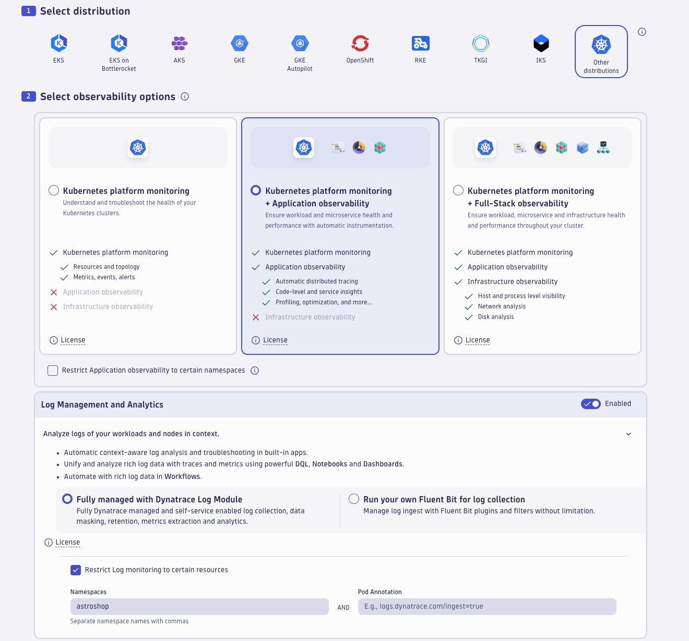
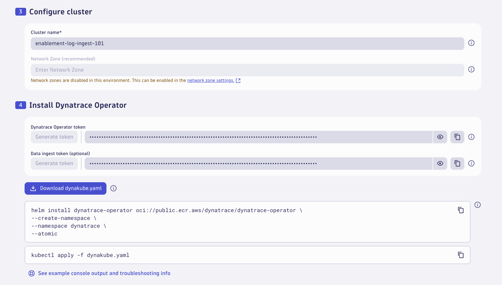
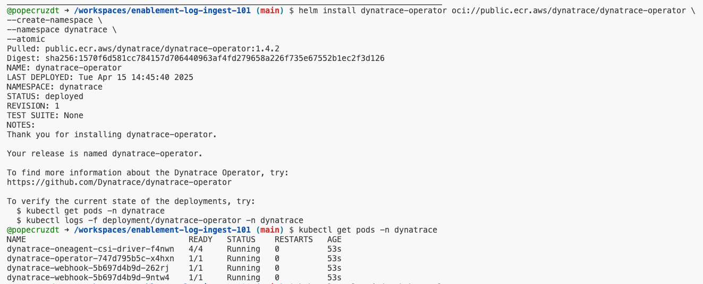
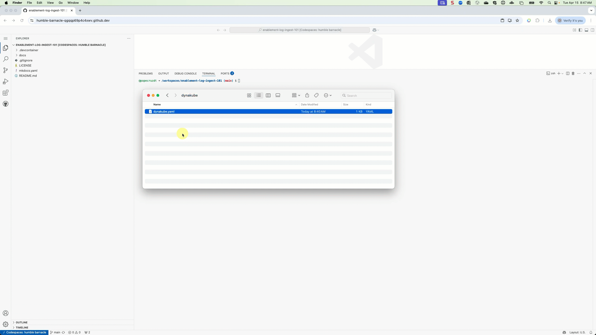
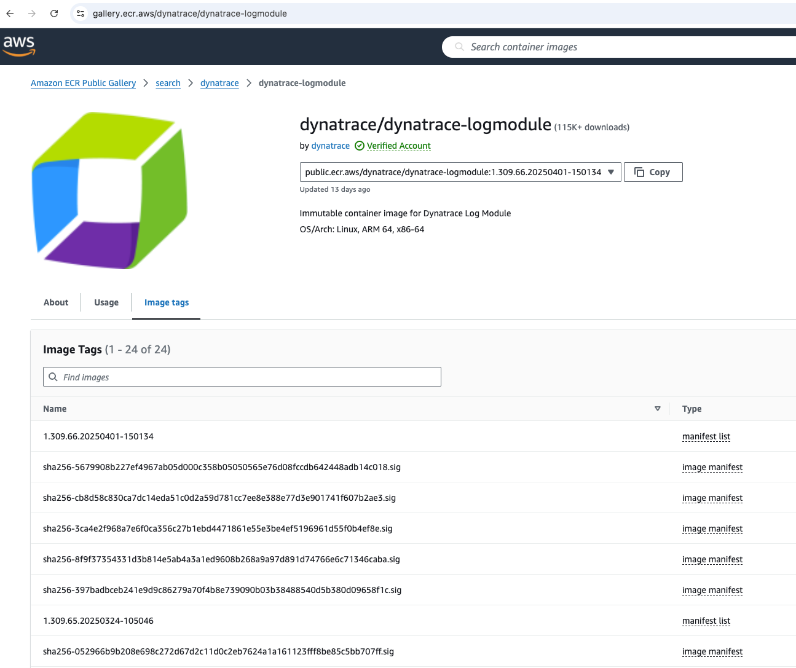
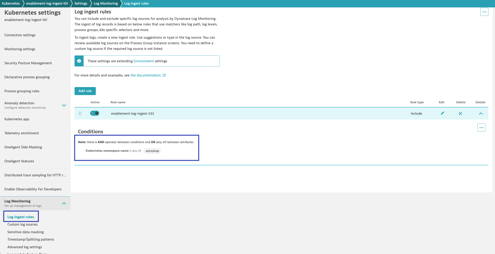

# Deploy Dynatrace
--8<-- "snippets/send-bizevent/4-deploy-dynatrace.js"

Dynatrace provides integrated Log management and analytics for your Kubernetes environments by either running the OneAgent Log module or integrating with log collectors such as Fluent Bit, Dynatrace OpenTelemetry Collector, Logstash, or Fluentd.

Dynatrace provides a flexible approach to Kubernetes observability where you can pick and choose the level of observability you need for your Kubernetes clusters. The Dynatrace Operator manages all the components needed to get the data into Dynatrace for you. This also applies to collecting logs from Kubernetes containers. Depending on the selected observability option, the Dynatrace Operator configures and manages the Log module to work in conjunction with or without a OneAgent on the node.

<div class="grid cards" markdown>
- [Learn More:octicons-arrow-right-24:](https://docs.dynatrace.com/docs/ingest-from/setup-on-k8s/deployment/k8s-log-monitoring)
</div>

## Kubernetes Platform Monitoring + Application Observability

Kubernetes platform monitoring sets the foundation for understanding and troubleshooting your Kubernetes clusters. This setup does not include OneAgent or application-level monitoring by default, but it can be combined with other monitoring and injection approaches.

!!! tip "[Kubernetes Platform Monitoring](https://docs.dynatrace.com/docs/ingest-from/setup-on-k8s/how-it-works/kubernetes-monitoring): Capabilities"
    - Provides insights into the health and utilization of your Kubernetes clusters, including object relationships (topology)
    - Uses the Kubernetes API and cAdvisor to get node- and container-level metrics and Kubernetes events
    - Enables out-of-the-box alerting and anomaly detection for workloads, Pods, nodes, and clusters

Application observability focuses on monitoring application-level metrics by injecting code modules into application Pods. This mode offers multiple injection strategies (automatic, runtime, and build-time) to collect application-specific metrics. For infrastructure-level insights, combine it with Kubernetes platform monitoring.

!!! tip "[Application Observability](https://docs.dynatrace.com/docs/ingest-from/setup-on-k8s/how-it-works/application-monitoring): Capabilities"
    - Dynatrace injects code modules into Pods using the Kubernetes admission controller.
    - Get granular control over the instrumented Pods using namespaces and annotations.
    - Route Pod metrics to different Dynatrace environments within the same Kubernetes cluster.
    - Enable data enrichment for Kubernetes environments.

### Start Monitoring Kubernetes

In your Dynatrace tenant, launch the `Kubernetes` app.  From the Overview tab, click on `Add cluster`.


**1. Select distribution**

Choose `Other distributions` as your distribution, as we will be deploying Dynatrace on a generic Kind Kubernetes cluster.

**2. Select observability options**

Choose `Kubernetes platform monitoring + Application observability` as your observability option.  This will define your Dynakube spec/configuration.

Toggle the `Log Management and Analytics` flag/setting to `Enabled`.  Expand the option and select `Fully managed with Dynatrace Log Module`.

Check the box for `Restrict Log monitoring to certain resources`.  In the `Namespaces` field, type `astroshop`.  This will filter log ingestion on logs related to the `astroshop` Kubernetes namespace.

Toggle the `Extensions` flag/setting to `Disabled`.  We will not be using this feature in this lab.



**3. Configure cluster**

Give your Kubernetes cluster a name, enter `enablement-log-ingest-101`.

**4. Install Dynatrace Operator**

Generate a Dynatrace Operator Token.  Copy and save the value somewhere, in case you need it.  The value will automatically be added to the `dynakube.yaml` file.

Generate a Data Ingest Token.  Copy and save the value somewhere, in case you need it.  The value will automatically be added to the `dynakube.yaml` file.

Download the `dynakube.yaml` file.

Copy the `helm install dynatrace-operator` command to your clipboard.  Use the command from your Dynatrace tenant, but it should look similar to this:
```sh
helm install dynatrace-operator oci://public.ecr.aws/dynatrace/dynatrace-operator \
--create-namespace \
--namespace dynatrace \
--atomic
```



### Deploy Dynatrace Operator

Navigate back to your GitHub Codespaces instance.  From the terminal, paste the `helm install dynatrace-operator` command and execute it.



Validate the new Dynatrace pods are running:
```sh
kubectl get pods -n dynatrace
```

### Deploy Dynakube

Locate the `dynakube.yaml` file that you downloaded from your tenant.  With the file (directory) open, navigate back to your GitHub Codespaces instance.  Click and hold to drag and drop the `dynakube.yaml` file into your Codespaces instance.



Deploy the Dynakube using `kubectl`.
```sh
kubectl apply -f dynakube.yaml
```

Wait 3-5 minutes and validate that the Dynatrace pods are running.
```sh
kubectl get pods -n dynatrace
```

| NAME                                             | READY | STATUS                  | RESTARTS | AGE  |
|--------------------------------------------------|-------|-------------------------|----------|------|
| dynatrace-oneagent-csi-driver-7b9kx              | 4/4   | Running                 | 0        | 3m5s |
| dynatrace-operator-747d795b5c-hrmtl              | 1/1   | Running                 | 0        | 3m5s |
| dynatrace-webhook-5b697d4b9d-6v95s               | 1/1   | Running                 | 0        | 3m5s |
| dynatrace-webhook-5b697d4b9d-nvslc               | 1/1   | Running                 | 0        | 3m5s |
| enablement-log-ingest-101-activegate-0           | 1/1   | Running                 | 0        | 90s  |
| enablement-log-ingest-101-logmonitoring-dxrsh    | 1/1   | Running                 | 0        | 89s  |

### Dynakube Log Module Spec

Enabling **Log Management and Analytics** with the option `Fully managed with Dynatrace Log Module` will add the Log Module to the Dynakube spec.

```yaml
---
apiVersion: dynatrace.com/v1beta3
kind: DynaKube
metadata:
  name: enablement-log-ingest-101
  namespace: dynatrace
  annotations:
    feature.dynatrace.com/k8s-app-enabled: "true"
spec:
  apiUrl: https://<tenant>/api
  metadataEnrichment:
    enabled: true
  oneAgent:
    applicationMonitoring: {}
  activeGate:
    capabilities:
      - routing
      - kubernetes-monitoring
    resources:
      requests:
        cpu: 100m
        memory: 512Mi
      limits:
        cpu: 500m
        memory: 768Mi
  templates:
    logMonitoring:
      imageRef:
        repository: public.ecr.aws/dynatrace/dynatrace-logmodule
        tag: 1.309.66.20250401-150134
  logMonitoring:
    ingestRuleMatchers:
      - attribute: k8s.namespace.name
        values:
          - astroshop
```

The Log Module runs as a container in a standalone pod (as part of a daemonset) on each node.  The `spec.templates.imageRef` defines the container image and tag to be used.

```yaml
templates:
    logMonitoring:
      imageRef:
        repository: public.ecr.aws/dynatrace/dynatrace-logmodule
        tag: 1.309.66.20250401-150134
```

!!! warning "ImagePullBackOff Error"
    In case you encounter an **ImagePullBackOff** error, check `public.ecr.aws` to make sure the container image with that tag exists.  If not, change the value to use an existing one.
    

Enabling the option **Restrict Log monitoring to certain resources** option will add `spec.logMonitoring.ingestRuleMatchers` to the Dynakube definition.

```yaml
logMonitoring:
    ingestRuleMatchers:
      - attribute: k8s.namespace.name
        values:
          - astroshop
```

!!! tip "Log Ingest Rule Configuration"
    Log ingest for the Log Module is controlled by the Dynatrace tenant, not the local Dynakube configuration!  This configuration is a quality of life feature that is to be used during the initial deployment of Dynatrace on Kubernetes.

By enabling the Log Module in your `dynakube.yaml` definition, this will enable the Dynakube to add a Log Ingest rule scoped at the Cluster-level within the Dynatrace tenant.

As of Dynatrace Operator version `1.4.2` and Dynatrace version `1.311`, the Log Ingest rule is added upon deployment and creation of the Kubernetes Cluster setting, but any further changes within the Dynakube's configuration will not update the setting.  Manage Log Ingest rules within the Dynatrace tenant.  If you seek to automate this process at the Kubernetes Cluster-level, consider deploying [Dynatrace Configuration As Code](https://docs.dynatrace.com/docs/deliver/configuration-as-code/monaco) to [manage the setting](https://docs.dynatrace.com/docs/deliver/configuration-as-code/monaco/reference/supported-configuration#settings).

<div class="grid cards" markdown>
- [Learn More:octicons-arrow-right-24:](https://docs.dynatrace.com/docs/analyze-explore-automate/logs/lma-log-ingestion/lma-log-ingestion-via-oa/lma-logs-from-kubernetes)
</div>

### Configure Log Ingest

In your Dynatrace tenant, return to the `Kubernetes` app.  Click on the `Explorer` tab.  In your list of Clusters, click on `enablement-log-ingest-101`.


From the Cluster overview pop-out, in the top right corner, click on the `...` ellipsis icon, and then click on the drilldown for **Log ingest rules**.


This will open the `Kubernetes Classic` app and the connection settings for the Kubernetes Cluster.  In the Log Monitoring settings, the Log Ingest rules are shown.  You'll find the rule that was created by the Dynakube that matches the configuration in the `dynakube.yaml` spec.  It should be configured to only ingest logs from the `astroshop` namespace.



### Refresh Application Pods

Now that Dynatrace is deployed, let's refresh/recycle the application pods for `astroshop` to inject the OneAgent code modules.

```sh
kubectl delete pods -n astroshop --field-selector="status.phase!=Running"
```

<div class="grid cards" markdown>
- [Continue to configuring Dynatrace Log Monitoring]:octicons-arrow-right-24:](4-content.md)
</div>